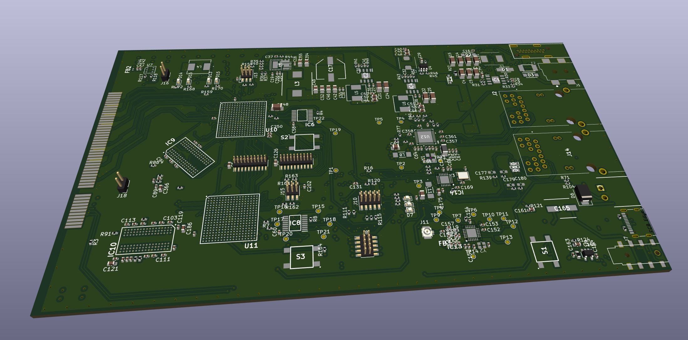

# RASBB - the RA-Sentinel Baseband Board

The RASBB is the interface between the world of analogue and discrete radio waves.
After the RFFE2400 has electrically been received, down converted to a zero intermediate frequency band and later on converted into a stream of discrete numbers,
The RASBB comes into play by lifting up the received goods from OSI layer 1 (Physical) to OSI layer 2 (Data link). 

# The hardware

The PCB of the RASBB contains several processing unit as well as sensors and radio interfaces.
Following you find a (incomplete) list of the features its features:

* Two Artix 7 FPGAs with 100k Logic Elements each
* 4 Gigabit (512MB with 16 Bit access) DDR3 Low Voltage DDR3 RAM
* STM32H7 high performance (up to 480MHz) ARM Cortex M7 micro-controller
* x8 PCIe Express slot which shall be compatible the PCI standards
* HDMI port, video generated in FPGA 1
* 40 Bits (32+8) inter processor communication bridge (accessible by external logic analyzers)
* Two separately usable 16M Flash chips for FPAG configuration, accessible by FPGA and STM32
* Temperature and Humidity sensor (physical environment supervision)
* Audio DAC with 1W output amplifier (Alarm and voice output)
* Audio ADC for capacitive microphone connection (acoustic environment surveillance)
* Open collector 30V/1A capable switching output (alarming devices)
* USB-C port with virtual COM port support for debugging/Updates
* 2.4GHz LoRaWAM(tm) moden chip for robust alarm distribution
* 100MBit/s ethernet port conencted to the STM32H7 MCU
* 1GBit/s ethernet port connected to FPGA 2
* Power Over Ethernet PoE Type 1 with a maximum power of 13W
* 4 LEDs for indication
* Configuration ond user button
* FPGAs and STM32 are accessible through JTAG port

The preliminary RA-Sentinel Baseband Board design will fit into a 100mm extrusion enclosure.

[PCB of the RASBB - work still in progress]
