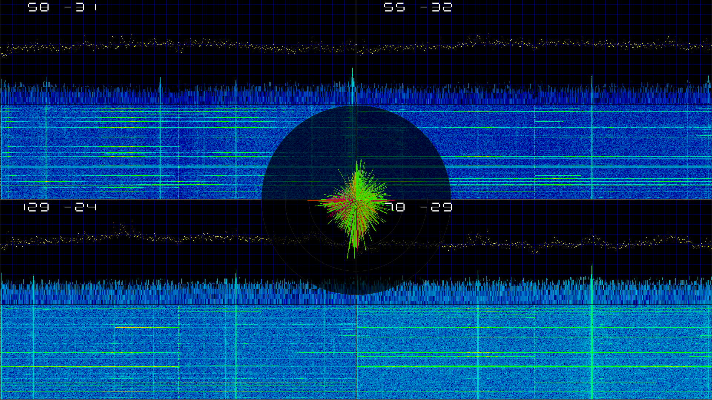

# RASPMO — Radio Access Spectrum Monitor

RASPMO is an FPGA design (Artix-7 XC7A100T, Vivado/Verilog) that turns the
RA-Sentinel hardware into a standalone four-channel 2.4 GHz spectrum monitor
with a live HDMI display — no PC or host software involved.

See it live in action on [youtube](https://www.youtube.com/watch?v=SnHPaw8y9vc)

## What it does

The RF front-end board (RASRF receives four independent 2.4 GHz channels (via four
MAX2831 zero-IF transceivers); two TI ADC3424 quad ADCs digitize the four I/Q
baseband pairs at 12 bit / 20 MSPS and ship them to the FPGA as eight
one-wire LVDS lanes. RASPMO deserializes the lanes with a self-calibrating
link (per-ADC IDELAY tap sweep plus per-lane word alignment, trained against
the ADC's built-in ramp test pattern at startup), removes the DC/zero-IF
offset, and runs four 1024-point complex FFT parallel across the four channels.

## Display

Output is 1080p HDMI, split into four 960×540 panes, one per receive channel.
Each pane shows the two-sided (complex) spectrum with a scrolling waterfall
below it, plus a readout of the averaged signal level in ADC absolute values and dBFS.
(dB from full scale away)
Right over the centre of the four panes sits a polar direction-finding
indicator driven by amplitude comparison between the channels. An optional
build switch (`SHOW_BER_RATES`) overlays per-lane bit-error counters for link
verification while the front-end runs its ADC ramp-test firmware.

## Hardware

RASPMO runs on the RA-Sentinel board set:

- **[RASBB](https://github.com/Tobias-DG3YEV/RA-Sentinel/tree/main/RASBB)** —
  baseband board carrying the Artix-7 FPGAs, HDMI output and the PCIe-style
  socket for the front-end card. RASPMO targets FPGA 1 (XC7A100T-CSG324).
- **[RASRF2400WBMC](https://github.com/Tobias-DG3YEV/RA-Sentinel/tree/main/RASRF2400WBMC)** —
  four-channel 2.4 GHz receiver front-end (4× MAX2831, 2× ADC3424, 40 MHz
  TCXO clocking, STM32C031 board controller that configures the RF chain).

## Building

`create_project.tcl` recreates the Vivado project from `RASPMO.srcs/`;
`top.mcs` is the flash image for the on-board configuration memory.

License: GNU GPL v3, © 2026 Tobias Weber. Part of the
[RA-Sentinel](https://github.com/Tobias-DG3YEV/RA-Sentinel) project.
